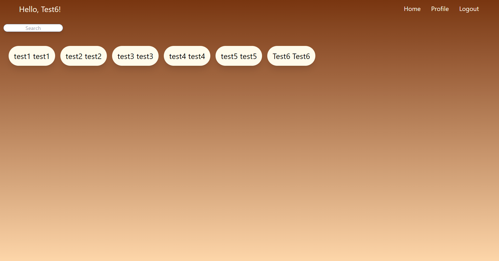
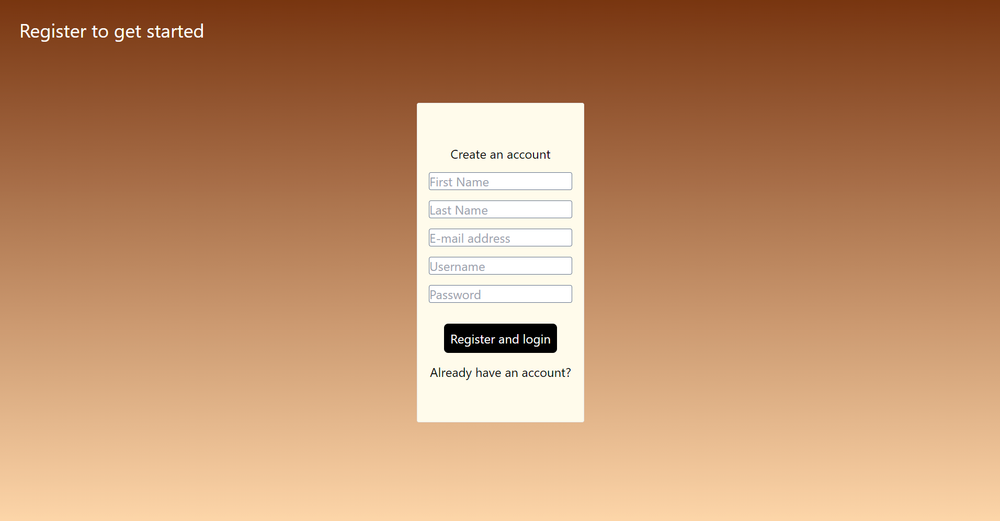
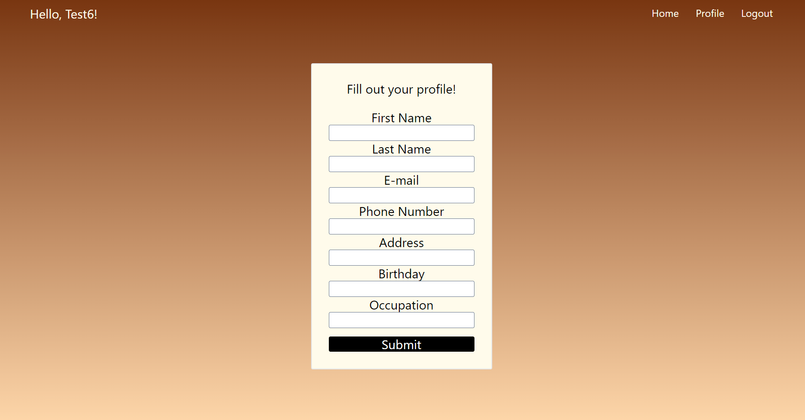
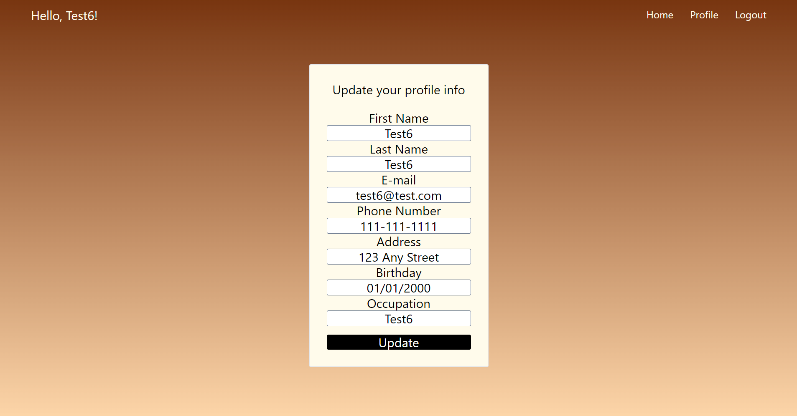
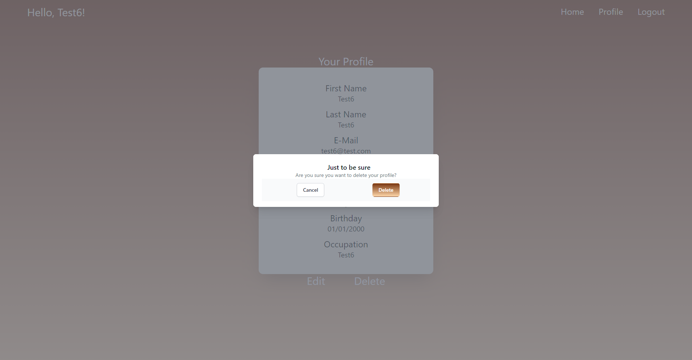
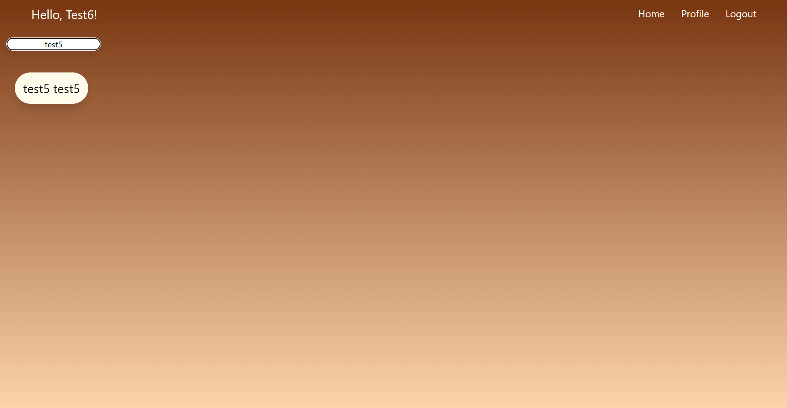
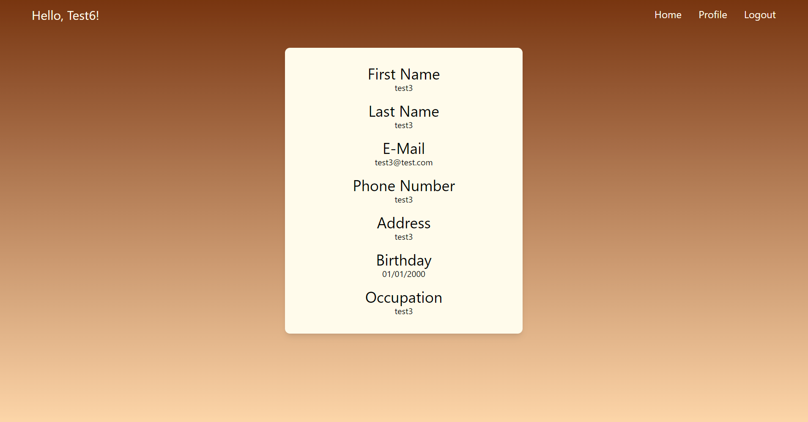
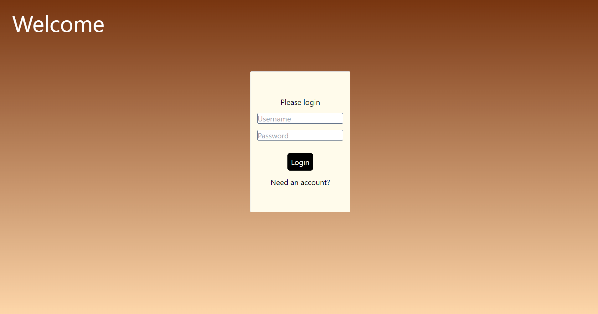

# Family Sharing App
As a way to stay connected, this app allows all members of the family to keep their information available to everyone else in the family without needing a social media app. It's similar to using a phone book to give someone a call. Users have the power to add what information they would like to share, as well as delete or update any information that changes.

##Table of Contents
* [Technologies Used](#technologiesused)
* [Dependencies Used](#dependenciesused)
* [How to Use](#use)

## <a name='technologiesused'>Technologies Used</a>

* React.js
* Tailwind CSS
* Node.js
* PostgreSQL
* Bit.io

## <a name='dependenciesused'>Dependencies Used</a>

* Axios
* Bcrypt.js
* CORS
* dotenv
* Express.js
* JSON Web Token
* React Router
* Sequelize

## <a name='use'>How to Use</a>

### Login or Register
Create an account on the login page to gain access to the server. User will input their first name, last name, e-mail address, what they would like their unique username to be, and a password. Once all fields are filled out, click the "Register and login" button.

### Create User Profile
Click on the "Profile" link in the upper-right portion of the screen. This will direct the user to their profile page.
From there, user can fill in any field that they wish to, while leaving the rest blank if they choose. Once all relevant information is filled in, user can then click the "Submit" button at the bottom of the form. This will populate the database with the information they provided.

### Edit User Profile
If any of the user's information changes at any time, or they wish to add more information, they can do so by clicking the "Edit" button just under the form on the profile page. This will allow their profile form to be editable. After the user is finished with making updates, they can click the "Update" button at the bottom of the form to send the new data to the database.

### Delete User Profile
If at any time the user decides they no longer want to have a profile on the application, they can remove it entirely by clicking the "Delete" button just under the profile form. They will be given a confirmation that they want to delete the profile, and upon clicking "Delete" inside the modal, the profile will be removed from the database.

### Searching for Members
Clicking the "Home" link in the upper-right portion of the screen will bring the user to the main page of the application, where they can search for other family members. The user can either scroll through the list of family members that have an existing profile, or they can search for specific family members by name.

### Member information
Once the user has found the family member they are looking for, they can click on their tab to bring up the field displaying the information that the family member filled in when they created their profile. To go back to the home page to search for another family member, simply click the "Home" link in the upper-right portion of the screen again to be routed back to the home page.

### Logout
Once the user is finished searching, they can log out of the system. They will be able to log back in on the login page by entering their username and password they created when first registering for an account.

